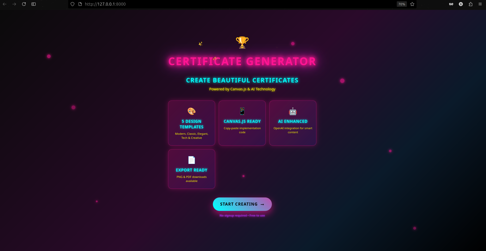
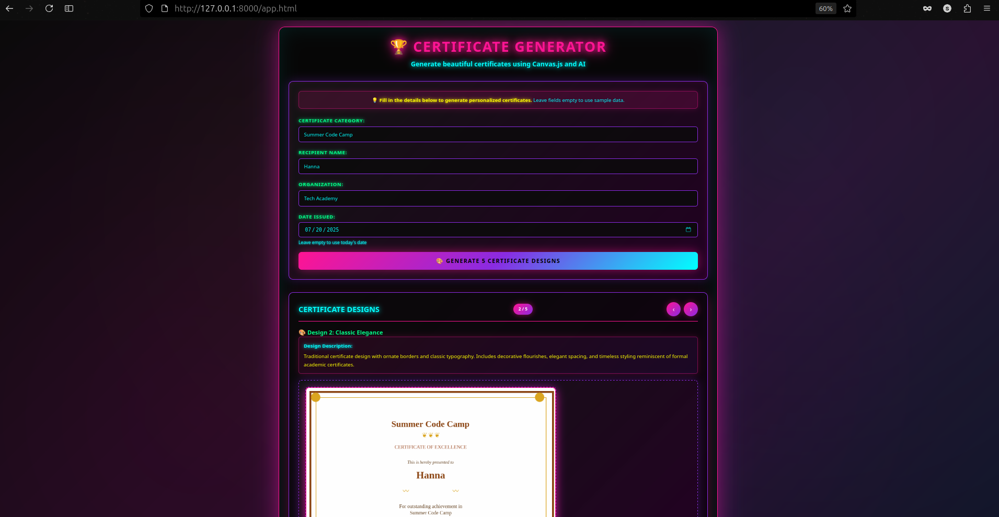
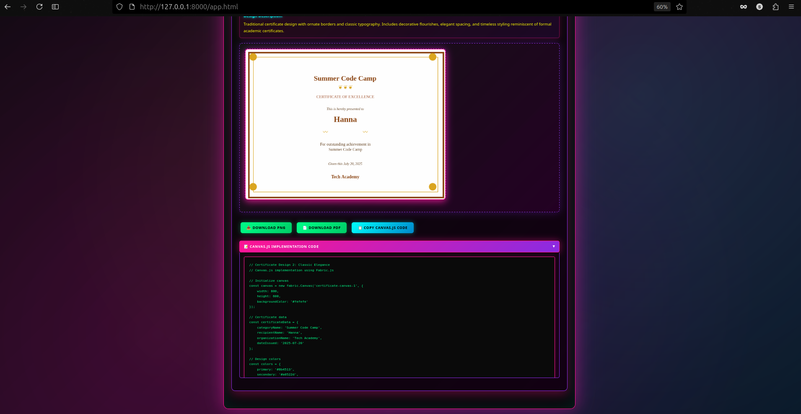

# Certificate Generator - Canvas.js & AI

A powerful web application that generates beautiful certificates using Canvas.js (Fabric.js) with optional AI/LLM integration. Features an animated landing page, sliding certificate viewer, and collapsible code sections.

## Features

- **Animated Landing Page**
  - Particle background effects
  - Interactive feature cards
  - Bouncing logo with sparkle animations
  - Smooth transitions to main app

- **5 Unique Design Templates**
  - Modern Professional
  - Classic Elegance  
  - Elegant Premium
  - Tech Innovation
  - Creative Artistic

- **Interactive Slider Interface**
  - Navigate between designs with arrow buttons
  - Keyboard support (arrow keys)
  - Touch/swipe support for mobile
  - Current slide indicator (1/5, 2/5, etc.)

- **Canvas.js Implementation**
  - Built with Fabric.js for rich canvas manipulation
  - **Perfect text alignment** with improved centering
  - Real-time preview
  - Responsive design
  - **Collapsible code sections** - click to expand/collapse
  - Copy-paste ready Canvas.js code

- **Export Options**
  - High-quality PNG download
  - PDF export with proper formatting
  - Copy Canvas.js implementation code with syntax highlighting


## Quick Start

### Method 1: Direct Run
```bash
# Navigate to the certificate generator directory
cd certificate_generator

# Start the development server
python3 -m http.server 8000

# Open in browser
open http://localhost:8000
```

### Method 2: Using npm scripts
```bash
# Install dependencies (optional - CDN links are used)
npm install

# Start the server
npm start

# Access at http://localhost:8000 (landing page)
# Main app: http://localhost:8000/app.html
```

## 📋 Usage

1. **Generate Certificates:**
   - Click "Generate 5 Certificate Designs" (or "Generate with Sample Data")
   - Wait for the certificates to render

2. **Download & Export:**
   - Download as PNG or PDF
   - Copy Canvas.js code for your own implementation


## Canvas.js Implementation

Each certificate is generated using Fabric.js and provides complete Canvas.js code:

```javascript
// Example: Initialize canvas
const canvas = new fabric.Canvas('certificate-canvas', {
    width: 800,
    height: 600,
    backgroundColor: '#ffffff'
});

// Add elements
const title = new fabric.Text('Certificate Title', {
    left: 400,
    top: 90,
    fontSize: 28,
    fontFamily: 'Arial Black',
    fill: '#2c3e50',
    textAlign: 'center',
    originX: 'center'
});
canvas.add(title);
```

## 📷 Screenshot




## Project Structure

```
certificate_generator/
├── index.html          # Main HTML file
├── styles.css          # Comprehensive CSS styling
├── script.js           # Main JavaScript application
├── package.json        # Project configuration
└── README.md          # Documentation
```

## Technical Details

### Dependencies
- **Fabric.js**: Canvas manipulation library
- **jsPDF**: PDF generation
- No build process required - all dependencies via CDN

### Canvas Specifications
- Default size: 800x600px
- Format: PNG/PDF export
- High-resolution output

## Customization

### Adding New Design Templates
```javascript
// Add to getPredefinedDesigns() method
{
    name: "Your Design Name",
    type: "your-type",
    description: "Design description",
    backgroundColor: "#ffffff",
    primaryColor: "#your-color",
    secondaryColor: "#your-color",
    accentColor: "#your-color",
    textColor: "#your-color"
}
```

### Custom Canvas Elements
```javascript
// Add custom shapes, text, or images
const customElement = new fabric.Text('Custom Text', {
    left: 100,
    top: 100,
    fontSize: 20,
    fill: '#000000'
});
canvas.add(customElement);
```
